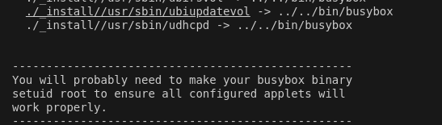
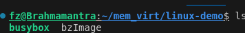
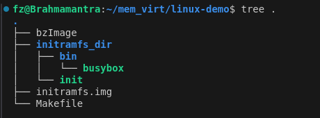
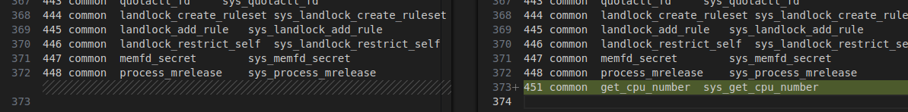
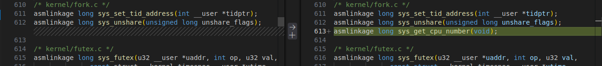
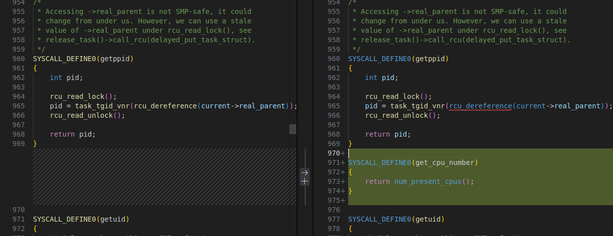
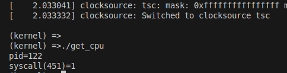

# 在Ubuntu上调试linux内核
我的OS:Ubuntu 22.04.5 LTS

## 前置工作

### 编译linux内核

#### 下载linux源码
[linux源码地址](https://www.kernel.org/)


#### 下载busybox源码
[busybox源码地址](https://www.busybox.net/downloads/)
- 用处：构建用户空间环境（例如ls rm等命令行工具）
BusyBox 是一个软件工具，它将许多标准的 Unix 工具集成到一个单一的可执行文件中。它被设计为一个小型的、功能齐全的工具箱，适用于嵌入式操作系统。BusyBox 提供了许多常见的 Unix 工具的简化版本，例如 ls、cp、mv、rm 等。

为什么编译 Linux 内核需要 BusyBox？
1. 嵌入式系统：在嵌入式系统中，资源（如存储和内存）通常非常有限。BusyBox 提供了一个紧凑的解决方案，可以在这些受限环境中运行。
2. 简化的用户空间：在开发和测试新的 Linux 内核时，使用 BusyBox 可以快速创建一个基本的用户空间环境，而不需要安装完整的 GNU 工具链。
3. 快速启动：BusyBox 的启动速度非常快，这对于需要快速启动的系统（如实时操作系统）非常重要。

#### 编译内核
    以linux-5.15.168，busybox-1.35.0为例
1. cd linux-5.15.168 && make mrproper 清除之前的构建和配置

2. make menuconfig 修改配置 (一般来说默认配置即可)
- 我这次的目的是为了调试kvm，所以要在Virtualization--->KVM support里按下Y,直接编译进内核（选M的时候我编译模块遇到了些问题，所以建议直接编进内核）
3. make -j15 15个线程编译linux内核 

- 编译过程中如果出现缺少一些c的头文件，直接sudo apt-get install xxx-dev加上应该就好了，不懂就丢给gpt
- 如果No rule to make target 'debian/canonical-certs.pem', needed by 'certs/x509_certificate_list'.  Stop.
make: *** [Makefile:1809: certs] Error 2，参考[这里](https://askubuntu.com/questions/1329538/compiling-kernel-5-11-11-and-later)

 ,修改.config（例如CONFIG_SYSTEM_TRUSTED_KEYS=""，CONFIG_SYSTEM_REVOCATION_KEYS=""）
- 一般是build到arch/x86/boot/bzImage,然后新建一个workspaces文件夹，把bzImage给copy进去

4. make modules_install编译相关模块

#### 编译busybox
1. cd busybox-1.35.0 && make mrproper 清除之前的构建和配置
2. make menuconfig 记得勾选上Seetings/Build static binary
3. make -j15 编译
4. make install  

5. cd _install/bin，能看到有一个busybox可执行文件，把他也cp到workspaces里面  


#### 制作initramfs
- 第一个进程init存储在根文件系统roofs或者内存文件系统ramfs
- 制作方式：
    busybox打包为cpio
    直接编译进内核 make menuconfig
1. mkdir initramfs_dir && cd initramfs_dir
2. mkdir bin && mv ../busybox ./bin/
3. touch init,这时候init是没有可执行权限的（可以输入ll查看），所以还要chmod -x init
4. vim init  
``` sh
#!/bin/busybox sh

# 挂载
/bin/busybox mkdir -p /proc && /bin/busybox mount -t proc none /proc

/bin/busybox echo "Hello MyLinux"

#更改命令提示符
export PS1='(kernel) =>'

/bin/busybox sh
``` 
5. 在workspaces中创建Makefile，并且写入
```  makefile
# 手动指定内核版本,选择自己的版本，6.1.114是我后面换的版本
KERNEL_VERSION := 6.1.114
cpimage:
	cp /home/fz/mem_virt/linux-6.1.114/arch/x86/boot/bzImage ./bzImage
initramfs:
	# 创建 /dev/kvm 设备节点
	mkdir -p ./initramfs_dir/dev
	sudo mknod ./initramfs_dir/dev/kvm c 10 232
	cd ./initramfs_dir && find . -print0 | cpio -ov --null --format=newc | gzip -9 > ../initramfs.img
run:
	qemu-system-x86_64\
    	-kernel bzImage\
    	-initrd initramfs.img\
    	-m 1G\
    	-nographic\
    	-append "earlyprintk=serial,ttyS0 console=ttyS0 nokaslr"\
    	-machine accel=kvm -enable-kvm\
    	-cpu host\
    	-gdb tcp::9000

clean:
    # 删除 cpimage 和 initramfs 产生的文件
	rm -f bzImage
	rm -f initramfs.img
	rm -rf ./initramfs_dir/lib
	rm -rf ./initramfs_dir/dev                              
```

6. make run运行内核，看到如下信息就算成功，因为内核里并没有ls，所以我们要用busybox ls.退出qemu用ctrl+a,x即可


### 利用gdb调试
参考链接：[https://www.bilibili.com/video/BV1dY411f75B?spm_id_from=333.788.player.switch&vd_source=3eacd6ea2b6bd5614c103c593a730d52](https://www.bilibili.com/video/BV1dY411f75B?spm_id_from=333.788.player.switch&vd_source=3eacd6ea2b6bd5614c103c593a730d52)
1. 先make run 启动内核（可通过-S使其阻塞），然后在linux-5.15.168目录（即开头make -j15的目录）中，命令行输入gdb vmlinux
```
(gdb) target remote:9000
Remote debugging using :9000
0x000000000000fff0 in exception_stacks ()
(gdb) break start_kernel
Breakpoint 1 at 0xffffffff834c2329: file init/main.c, line 940.
```
这时我们在linux-5.15.168目录下,vim System.map，找到start_kernel，发现它对应的地址就是0xffffffff834c2329
2. 为了避免重复操作，我们可以在linux-5.15.168目录下创建.gdbinit文件，并在里面输入我们每次打开gdb需要重复输入的内容，比如
```
target remote :9000
break start_kernel
```
随后再次gdb vmlinux,如果遇到了要 add-auto-load-safe-path的问题，是正常的，按照提示操作即可
3. Vscode里配置.json，通过IDE实现更加简便的调试
 1. 配置launch.json，示范：
 ```JSON
 {
    // Use IntelliSense to learn about possible attributes.
    // Hover to view descriptions of existing attributes.
    // For more information, visit: https://go.microsoft.com/fwlink/?linkid=830387
    "version": "0.2.0",
    "configurations": [
        {
            "name": "qemu_kernel-gdb",
            "type": "cppdbg",
            "request": "launch",
            "miDebuggerServerAddress": "127.0.0.1:9000",
            "program": "${workspaceFolder}/vmlinux",
            "args": [],
            "stopAtEntry": false,
            "cwd": "${workspaceFolder}",
            "environment": [],
            "externalConsole": false,
            "logging": {
                "engineLogging": true,
            },
            "MIMode": "gdb",
        }
    ]
}
 ```

4. 解决代码爆红问题
运行./scripts/clang-tools/gen_compile_commands.py脚本，会在.目录生成一个compile_commands.json,随后配置c_cpp_properties.json，
 1. ctrl+shift+p选择C/C++:edit configurations,然后配置信息大概如下,主要是增加"compileCommands"
 ``` JSON
 {
    "configurations": [
        {
            "name": "Linux",
            "includePath": [
                "${workspaceFolder}/**"
            ],
            "defines": [],
            "cStandard": "c17",
            "cppStandard": "c++14",
            "intelliSenseMode": "linux-clang-x64",
            "configurationProvider": "ms-vscode.makefile-tools",
            "compileCommands": "${workspaceFolder}/compile_commands.json"
        }
    ],
    "version": 4
}
 ```
### 增加一个新的系统调用 get_cpu_number
#### 在内核里修改代码
1. 注册系统调用 
2. 声明系统调用
3. 编写系统调用具体逻辑
4. 重新编译linux内核,然后执行Makefile相应操作(make clean,make cpimage,make initramfs,make run)
#### 编写测试程序
1. 写一个test_syscall.c，如下
``` c
#include<stdio.h>
#include<unistd.h>
//#include<sys/syscall.h>

int main(){
        int pid = syscall(39);
        printf("pid=%d\n",pid);

        int res = syscall(451);
        printf("syscall(451)=%d\n",res);
        return 0;
}
```
2. **要用gcc静态编译！！**
gcc -static test_syscall.c -o get_cpu

3. 在linux里调用./get_cpu,获得输出,代表该系统调用测试正确
